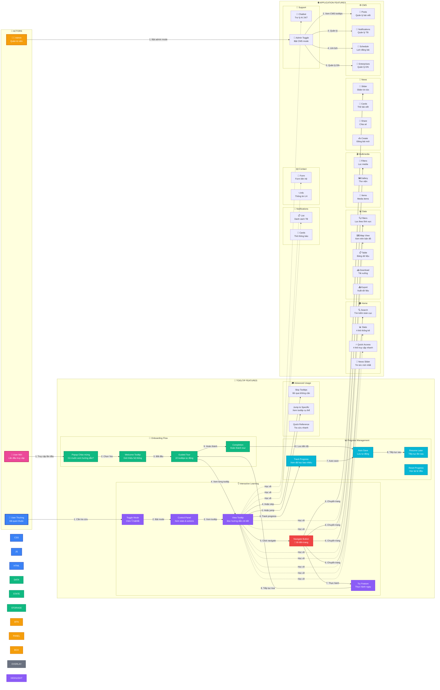

# 📊 Sơ đồ Hệ thống Tooltip

## 1️⃣ Sơ đồ Kiến trúc Module & Chức năng

```mermaid
graph TB
    subgraph "🎯 HỆ THỐNG TOOLTIP"
        direction TB
        
        subgraph "📦 CORE MODULES"
            CSS[tooltip-system.css<br/>📄 Styles & Animations<br/>8.5 KB]
            JS[tooltip-system.js<br/>⚙️ Logic & Data<br/>13 KB]
            HTML[HTML Components<br/>🎨 UI Elements]
        end
        
        subgraph "💾 DATA LAYER"
            DATA[TOOLTIPS_DATA<br/>📚 22 Tooltips<br/>7 Categories]
            STATE[tooltipState<br/>🔄 State Management<br/>isActive, currentIndex, viewed]
            STORAGE[LocalStorage<br/>💿 Persistence<br/>Auto-save]
        end
        
        subgraph "🎨 UI COMPONENTS"
            BTN[Toggle Button<br/>💡 Floating Button<br/>Bottom Right]
            PANEL[Control Panel<br/>📊 Stats & Actions<br/>Top Right]
            BOX[Tooltip Box<br/>💬 Content Display<br/>Dynamic Position]
            OVERLAY[Overlay<br/>🌑 Background Dim<br/>50% Black]
            HIGHLIGHT[Highlight Effect<br/>✨ Purple Border<br/>Pulse Animation]
        end
        
        subgraph "⚙️ CORE FUNCTIONS"
            F1[toggleTooltipMode<br/>🔘 Bật/Tắt Mode]
            F2[startGuidedTour<br/>🎯 Tour Tự động]
            F3[showTooltip<br/>👁️ Hiển thị Tooltip]
            F4[navigateToSection<br/>🔗 Navigate + Continue]
            F5[updateStats<br/>📈 Cập nhật Tiến độ]
            F6[saveState<br/>💾 Lưu LocalStorage]
        end
        
        subgraph "🔗 NAVIGATION FEATURES"
            NAV1[Navigate Buttons<br/>🔗 5 Tooltips có nút]
            NAV2[Auto-continue<br/>⏭️ Tiếp tục sau navigate]
            NAV3[Section Switching<br/>🔄 Chuyển trang mượt]
        end
        
        subgraph "📚 TOOLTIP CATEGORIES"
            CAT1[Navigation<br/>🧭 7 tooltips]
            CAT2[Stats Banner<br/>📊 4 tooltips]
            CAT3[Search & Quick<br/>🔍 5 tooltips]
            CAT4[Data Section<br/>📁 5 tooltips]
            CAT5[Multimedia<br/>🎬 3 tooltips]
            CAT6[News<br/>📰 4 tooltips]
            CAT7[Support<br/>💬 2 tooltips]
        end
    end
    
    CSS --> HTML
    JS --> DATA
    JS --> STATE
    STATE --> STORAGE
    
    HTML --> BTN
    HTML --> PANEL
    HTML --> BOX
    HTML --> OVERLAY
    HTML --> HIGHLIGHT
    
    JS --> F1
    JS --> F2
    JS --> F3
    JS --> F4
    JS --> F5
    JS --> F6
    
    F1 --> BTN
    F1 --> PANEL
    F2 --> F3
    F3 --> BOX
    F3 --> OVERLAY
    F3 --> HIGHLIGHT
    F4 --> NAV1
    F4 --> NAV2
    F4 --> NAV3
    F5 --> PANEL
    F6 --> STORAGE
    
    DATA --> CAT1
    DATA --> CAT2
    DATA --> CAT3
    DATA --> CAT4
    DATA --> CAT5
    DATA --> CAT6
    DATA --> CAT7
    
    style CSS fill:#3b82f6,stroke:#1e40af,stroke-width:3px,color:#fff
    style JS fill:#3b82f6,stroke:#1e40af,stroke-width:3px,color:#fff
    style HTML fill:#3b82f6,stroke:#1e40af,stroke-width:3px,color:#fff
    style DATA fill:#10b981,stroke:#059669,stroke-width:2px,color:#fff
    style STATE fill:#10b981,stroke:#059669,stroke-width:2px,color:#fff
    style STORAGE fill:#10b981,stroke:#059669,stroke-width:2px,color:#fff
    style BTN fill:#f59e0b,stroke:#d97706,stroke-width:2px,color:#fff
    style PANEL fill:#f59e0b,stroke:#d97706,stroke-width:2px,color:#fff
    style BOX fill:#f59e0b,stroke:#d97706,stroke-width:2px,color:#fff
    style OVERLAY fill:#6b7280,stroke:#4b5563,stroke-width:2px,color:#fff
    style HIGHLIGHT fill:#8b5cf6,stroke:#7c3aed,stroke-width:2px,color:#fff
    style F1 fill:#ef4444,stroke:#dc2626,stroke-width:2px,color:#fff
    style F2 fill:#ef4444,stroke:#dc2626,stroke-width:2px,color:#fff
    style F3 fill:#ef4444,stroke:#dc2626,stroke-width:2px,color:#fff
    style F4 fill:#ef4444,stroke:#dc2626,stroke-width:2px,color:#fff
    style F5 fill:#ef4444,stroke:#dc2626,stroke-width:2px,color:#fff
    style F6 fill:#ef4444,stroke:#dc2626,stroke-width:2px,color:#fff
    style NAV1 fill:#8b5cf6,stroke:#7c3aed,stroke-width:2px,color:#fff
    style NAV2 fill:#8b5cf6,stroke:#7c3aed,stroke-width:2px,color:#fff
    style NAV3 fill:#8b5cf6,stroke:#7c3aed,stroke-width:2px,color:#fff
```

---

## 2️⃣ Sơ đồ Actor & Tương tác

### 📖 Giải thích Sơ đồ 1:

**Core Modules (Xanh dương):**
- CSS: Styles và animations
- JS: Logic và data
- HTML: UI components

**Data Layer (Xanh lá):**
- TOOLTIPS_DATA: 22 tooltips
- tooltipState: Quản lý state
- LocalStorage: Lưu trữ

**UI Components (Cam):**
- Toggle button, Panel, Box, Overlay, Highlight

**Core Functions (Đỏ):**
- 6 functions chính điều khiển hệ thống

**Navigation Features (Tím):**
- Navigate buttons, Auto-continue, Section switching

---

## 2️⃣ Sơ đồ Actor & Use Cases

```mermaid
flowchart TD
    subgraph ACTORS["👥 CÁC ACTOR"]
        A1["👤 USER MỚI<br/>(Lần đầu truy cập)"]
        A2["👤 USER THƯỜNG<br/>(Đã quen thuộc)"]
        A3["👨‍💼 ADMIN<br/>(Quản trị viên)"]
    end
    
    subgraph SYSTEM["🎯 HỆ THỐNG TOOLTIP"]
        direction TB
        
        subgraph UC1["🔰 USE CASE 1: Onboarding"]
            UC1_1["Hiển thị Popup<br/>Chào mừng"]
            UC1_2["User chọn<br/>Yes/No"]
            UC1_3["Bắt đầu<br/>Guided Tour"]
            UC1_4["Xem 22 Tooltips<br/>Từng bước"]
            UC1_5["Navigate đến<br/>Các trang"]
            UC1_6["Hoàn thành<br/>Tour"]
        end
        
        subgraph UC2["💡 USE CASE 2: Quick Help"]
            UC2_1["Click nút 💡<br/>Bật tooltip mode"]
            UC2_2["Control Panel<br/>Hiển thị"]
            UC2_3["Hover/Click<br/>Element"]
            UC2_4["Tooltip hiển thị<br/>Hướng dẫn"]
            UC2_5["Click Navigate<br/>Đi đến trang"]
            UC2_6["Thực hành<br/>Chức năng"]
        end
        
        subgraph UC3["📊 USE CASE 3: Progress Tracking"]
            UC3_1["Xem tiến độ<br/>Trong panel"]
            UC3_2["Tooltips đã xem<br/>Được đánh dấu"]
            UC3_3["LocalStorage<br/>Lưu tự động"]
            UC3_4["Quay lại sau<br/>Tiếp tục học"]
            UC3_5["Reset nếu cần<br/>Học lại"]
        end
        
        subgraph UC4["🎓 USE CASE 4: Advanced"]
            UC4_1["Skip tooltips<br/>Không cần"]
            UC4_2["Jump to specific<br/>Tooltip cụ thể"]
            UC4_3["Quick reference<br/>Tra cứu nhanh"]
            UC4_4["Tắt mode<br/>Khi không cần"]
        end
        
        subgraph UC5["⚙️ USE CASE 5: Admin"]
            UC5_1["Bật Admin Mode<br/>Toggle checkbox"]
            UC5_2["CMS Menu<br/>Hiển thị"]
            UC5_3["Xem CMS Tooltips<br/>Hướng dẫn quản trị"]
            UC5_4["Quản lý<br/>Nội dung"]
        end
    end
    
    subgraph FEATURES["🌐 CHỨC NĂNG ỨNG DỤNG"]
        direction TB
        
        subgraph F1["🏠 Trang chủ"]
            F1_1[Search Bar]
            F1_2[Stats Cards]
            F1_3[Quick Access]
            F1_4[News Slider]
        end
        
        subgraph F2["📊 Dữ liệu"]
            F2_1[Filter Tabs]
            F2_2[Data Cards]
            F2_3[Map View]
            F2_4[Data Table]
            F2_5[Download]
        end
        
        subgraph F3["🎬 Multimedia"]
            F3_1[Media Filters]
            F3_2[Media Gallery]
            F3_3[Media Items]
        end
        
        subgraph F4["📰 Tin tức"]
            F4_1[News Slider]
            F4_2[Article Cards]
            F4_3[Share Buttons]
            F4_4[Create Post]
        end
        
        subgraph F5["🔔 Thông báo"]
            F5_1[Notification List]
            F5_2[Notification Cards]
        end
        
        subgraph F6["✉️ Liên hệ"]
            F6_1[Contact Form]
            F6_2[Contact Info]
        end
        
        subgraph F7["⚙️ CMS"]
            F7_1[Quản lý Bài viết]
            F7_2[Quản lý TB]
            F7_3[Lịch đăng]
            F7_4[Quản lý DN]
        end
        
        subgraph F8["💬 Support"]
            F8_1[Chatbot AI]
            F8_2[Admin Toggle]
        end
    end
    
    %% User Mới Flow
    A1 ==>|Lần đầu| UC1_1
    UC1_1 -->|Yes| UC1_2
    UC1_2 --> UC1_3
    UC1_3 --> UC1_4
    UC1_4 -->|Tooltip có nút| UC1_5
    UC1_5 --> F1_1
    UC1_5 --> F2_1
    UC1_5 --> F3_1
    UC1_5 --> F4_1
    UC1_4 --> UC1_6
    UC1_6 --> UC3_3
    
    %% User Thường Flow
    A2 ==>|Cần help| UC2_1
    UC2_1 --> UC2_2
    UC2_2 --> UC2_3
    UC2_3 --> UC2_4
    UC2_4 -->|Click 🔗| UC2_5
    UC2_5 --> F1_1
    UC2_5 --> F2_1
    UC2_5 --> F3_1
    UC2_5 --> UC2_6
    UC2_6 --> UC3_1
    UC3_1 --> UC3_2
    UC3_2 --> UC3_3
    UC3_3 --> UC3_4
    
    %% Advanced Flow
    A2 -.->|Nâng cao| UC4_1
    UC4_1 --> UC4_2
    UC4_2 --> UC4_3
    UC4_3 --> UC4_4
    
    %% Admin Flow
    A3 ==>|Admin tasks| UC5_1
    UC5_1 --> UC5_2
    UC5_2 --> UC5_3
    UC5_3 --> UC5_4
    UC5_4 --> F7_1
    UC5_4 --> F7_2
    UC5_4 --> F7_3
    UC5_4 --> F7_4
    
    %% Tooltips to Features
    UC1_4 -.->|Hướng dẫn| F1_1
    UC1_4 -.->|Hướng dẫn| F1_2
    UC1_4 -.->|Hướng dẫn| F1_3
    UC1_4 -.->|Hướng dẫn| F2_1
    UC1_4 -.->|Hướng dẫn| F2_2
    UC1_4 -.->|Hướng dẫn| F3_1
    UC1_4 -.->|Hướng dẫn| F4_1
    UC1_4 -.->|Hướng dẫn| F8_1
    
    %% Styling
    style A1 fill:#ec4899,stroke:#be185d,stroke-width:4px,color:#fff
    style A2 fill:#3b82f6,stroke:#1e40af,stroke-width:4px,color:#fff
    style A3 fill:#f59e0b,stroke:#d97706,stroke-width:4px,color:#fff
    
    style UC1_1 fill:#10b981,stroke:#059669,stroke-width:2px,color:#fff
    style UC1_2 fill:#10b981,stroke:#059669,stroke-width:2px,color:#fff
    style UC1_3 fill:#10b981,stroke:#059669,stroke-width:2px,color:#fff
    style UC1_4 fill:#10b981,stroke:#059669,stroke-width:2px,color:#fff
    style UC1_5 fill:#ef4444,stroke:#dc2626,stroke-width:2px,color:#fff
    style UC1_6 fill:#10b981,stroke:#059669,stroke-width:2px,color:#fff
    
    style UC2_1 fill:#8b5cf6,stroke:#7c3aed,stroke-width:2px,color:#fff
    style UC2_2 fill:#8b5cf6,stroke:#7c3aed,stroke-width:2px,color:#fff
    style UC2_3 fill:#8b5cf6,stroke:#7c3aed,stroke-width:2px,color:#fff
    style UC2_4 fill:#8b5cf6,stroke:#7c3aed,stroke-width:2px,color:#fff
    style UC2_5 fill:#ef4444,stroke:#dc2626,stroke-width:2px,color:#fff
    style UC2_6 fill:#8b5cf6,stroke:#7c3aed,stroke-width:2px,color:#fff
    
    style UC3_1 fill:#06b6d4,stroke:#0891b2,stroke-width:2px,color:#fff
    style UC3_2 fill:#06b6d4,stroke:#0891b2,stroke-width:2px,color:#fff
    style UC3_3 fill:#06b6d4,stroke:#0891b2,stroke-width:2px,color:#fff
    style UC3_4 fill:#06b6d4,stroke:#0891b2,stroke-width:2px,color:#fff
    style UC3_5 fill:#06b6d4,stroke:#0891b2,stroke-width:2px,color:#fff
```

### 📖 Giải thích Sơ đồ 2:

#### 👥 Actors (3 loại người dùng):

**👤 User Mới (Hồng):**
- Lần đầu truy cập hệ thống
- Cần onboarding đầy đủ
- Sử dụng Guided Tour

**👤 User Thường (Xanh dương):**
- Đã quen thuộc với hệ thống
- Cần tra cứu nhanh
- Sử dụng tooltips riêng lẻ

**👨‍💼 Admin (Cam):**
- Quản trị viên
- Cần hướng dẫn CMS
- Quản lý nội dung

#### 🎯 Use Cases:

**UC1: Onboarding (Xanh lá):**
1. Popup chào mừng
2. Welcome tooltip
3. Guided tour 22 bước
4. Navigate đến các trang
5. Hoàn thành và lưu

**UC2: Quick Help (Tím):**
1. Bật tooltip mode
2. Xem control panel
3. Click element
4. Đọc hướng dẫn
5. Navigate và thực hành

**UC3: Progress Tracking (Xanh ngọc):**
1. Xem tiến độ
2. Auto-save
3. Resume later
4. Reset nếu cần

**UC4: Advanced (Xám):**
- Skip tooltips
- Jump to specific
- Quick reference

**UC5: Admin (Cam):**
- Bật admin mode
- Xem CMS tooltips
- Quản lý nội dung

---

## 📊 Thống kê Sơ đồ

### Sơ đồ 1: Architecture
- **Modules:** 3 core
- **Data layers:** 3
- **UI components:** 5
- **Functions:** 6
- **Features:** 3
- **Categories:** 7

### Sơ đồ 2: Use Cases
- **Actors:** 3
- **Use cases:** 5
- **Features:** 8 nhóm
- **Total interactions:** 40+

## 🎨 Màu sắc trong Sơ đồ

| Màu | Ý nghĩa | Sử dụng cho |
|-----|---------|-------------|
| 🔵 Xanh dương | Core/Primary | Modules, User thường |
| 🟢 Xanh lá | Success/Data | Onboarding, Data layer |
| 🟠 Cam | Warning/UI | UI Components, Admin |
| 🔴 Đỏ | Action/Important | Functions, Navigate |
| 🟣 Tím | Feature/Interactive | Learning, Highlight |
| 🔷 Xanh ngọc | Info/Progress | Progress tracking |
| ⚫ Xám | Neutral/Support | Overlay, Advanced |
| 🌸 Hồng | New/Special | User mới |

## 🔗 Mối quan hệ

### Solid Lines (─):
- Quan hệ trực tiếp, bắt buộc
- Flow chính của hệ thống

### Dashed Lines (- -):
- Quan hệ gián tiếp, optional
- Reference, learning

###
